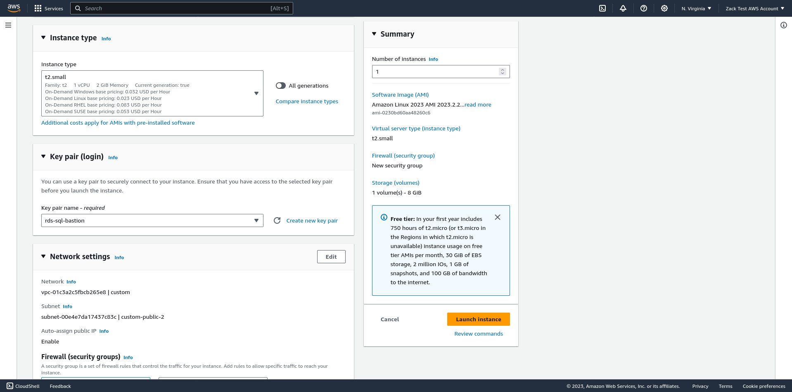
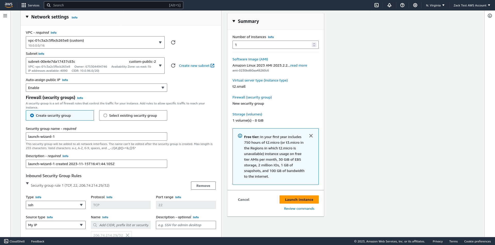
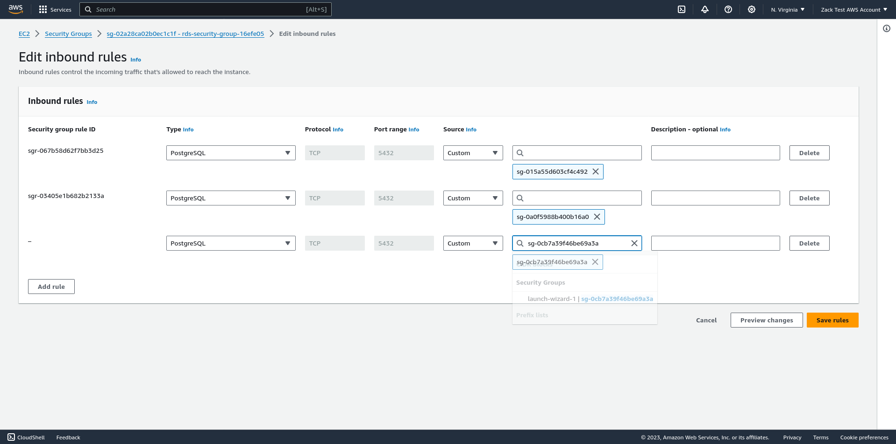

# Common tasks 

# Jump host

This document contains instructions for common tasks when working with the AWS Reference Architecture. 

## Use a Jump host to access resources running in the private subnet 

For security reasons, the Reference Architecture's VPC divides resources into public and private subnets. The frontend UI microservice runs in the 
public subnet, and everything else, including the RDS Postgres database and the backend microservices, run in the private subnet.

Resources running in the private subnets are not directly accessible via the public internet, by design. Therefore, in order to query the database directly
or perform any other tasks that require direct access to the backend, you must connect through a "jump" or bastion host that runs in the public subnet but 
has access to private resources. 

## Provision the jump host

At a high-level, this involves launching a new EC2 instance into the public subnet and granting its security group access to the RDS Database by adding an inbound 
rule allowing traffic from the jump host's security group into the RDS Postgres database's security group. 

On the EC2 dashboard, choose Launch an instance. Choose the default Amazon Linux flavor as well as the recommended Amazon Machine Image (AMI).

Ensure that your jump host: 
1. will be launched into the same VPC that your Reference Architecture deployed
1. will be launched in one of your VPC's public subnets
1. will automatically have a public IPv4 address assigned to it
1. will be launched into a new security group. You can accept the default suggestion for the name

Create a new SSH keypair, if you don't already have one, and chose `.pem` format. 

When you create a new keypair, the AWS web console will force download the private key to your machine. Check 
your downloads folder, and run the following command to ensure the correct permissions on your key, otherwise your SSH client will complain: 

`chmod 400 ~/Downloads/<your-private-key>.pem`

Launch your instance and wait a few moments for its status to change to Available: 

Ensure your SSH configuration is working properly by connecting to your jump host over ssh: 

`ssh -i ~/Downloads/<your-private-key>.pem ec2-user@<your-jumphost-public-ipv4-address>`

## Grant your jump host access to resources running in the backend

The RDS Postgres database is running in its own security group. By design, this security group only grants access to: 
1. the frontend microservice's security group, because the frontend issues database queries
1. the pelican microservice's security group, because Pelican listens to the Postgres database for changes

In order to allow your jump host to access the Postgres RDS database directly, in order to give yourself direct access via 
tools like `psql`, you must first look up the ID of the security group that was created for your jump host when you launched it: 

Once you know the ID of your jump host's security group, go to the EC2 dashboard > Security groups and find the RDS Security group. 

Edit the RDS security group and add a new inbound rule. For the protocol, set `PostgreSQL` which automatically allows access via port 5432.

## Install the Postgres client on the jump host 

On box, install `psql`: 
sudo yum update
sudo yum search "postgres"

Find the latest package, for example at the time of writing: 
`sudo yum install -y postgresql15.x86_64`

## Connect to the Postgres database from the jump host 

PSQL connect: 
`psql -h mydb0e0dbc2.c4ztncw5rxvr.us-east-1.rds.amazonaws.com -U postgres`

## SSH to the jump host from your machine

SSH: 
`ssh -i ~/Downloads/rds-sql-bastion.pem ec2-user@54.88.236.252`

## Use SCP to transfer files from your machine to the jump host 

SCP: 
`scp -i ~/Downloads/rds-sql-bastion.pem ~/Pinecone/ref-arch-init/semantic-search-postgres/data/one_million_products.csv ec2-user@54.88.236.252:/home/ec2-user/one_million_products.csv`

## Load test records into the Postgres database from the jump host 

PSQL load from Jumphost:
`\copy products_with_increment(name, sku, description, price, last_updated) FROM './one_million_products.csv' WITH (FORMAT csv, HEADER true, DELIMITER ',');

# Destroying the RefArch 

The inverse of `pulumi up` is `pulumi destroy`. Generally speaking, running `pulumi destroy` from the root of the project and accepting the confirmation prompt will commence tear down of 
the Reference Architecture. 

Destroying the Reference Architecture takes about as long as spinning it up: ~20 minutes or so depending on several factors. 

**N.B:** If you used the above instructions to create a jump host, you must first do the following before the `pulumi destroy` will run end to end cleanly:
* Terminate the EC2 jump host instance 
* Delete the EC2 jump host instance's security group 
* Update the RDS Security group so that it no longer includes the rule allowing access to the jump host's security group 

These changes will ensure that the AWS control plane does not get tripped up on lingering dependencies that are not managed via Pulumi. 
